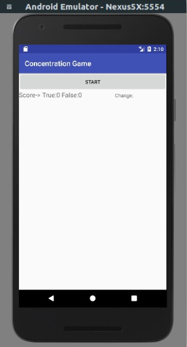
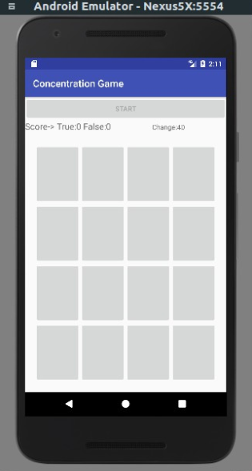
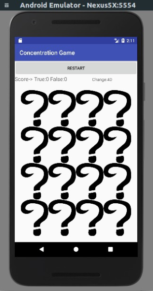
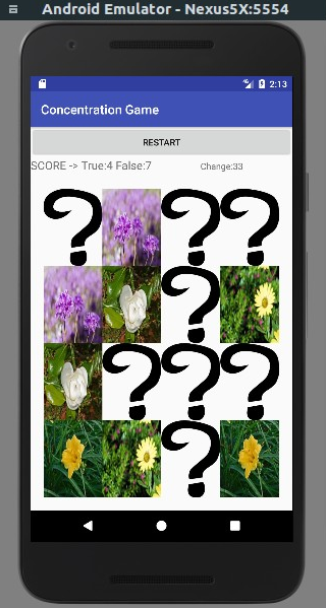
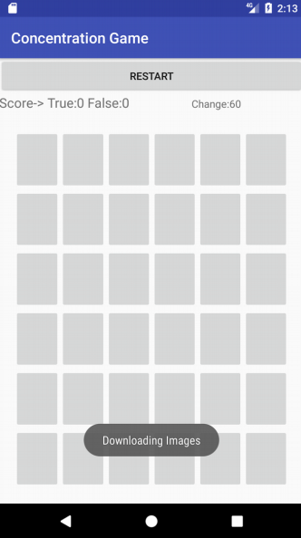
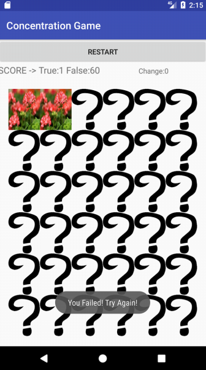

# Concentration Game on Android

This project created for CSE312 Operating Systems. Main purpose of this game is using threads, using shared objects with multithread systems.

### Game Strategy
 * Game starts N*N board (initial N=4)
 * Each level user has N*10 change to find all pictures
 * When found all paired images, board area increases +2

### Important points
* Main thread starts ImageListDownloader thread to download N*N/2 image url from **Pixabay**
* When urls dowload operation completed, Downloader thread starts new N*N thread to donwload images synchronously in a shared area
* After all images downloaded, ImageListDownloader thread sets images to buttons and game starts.
* All threads log their start-stop and total run time.

### Example Images
* Open Game/Images downloading
 

* Images Downloaded / Click Images
 

* LevelUp / Changes done
 